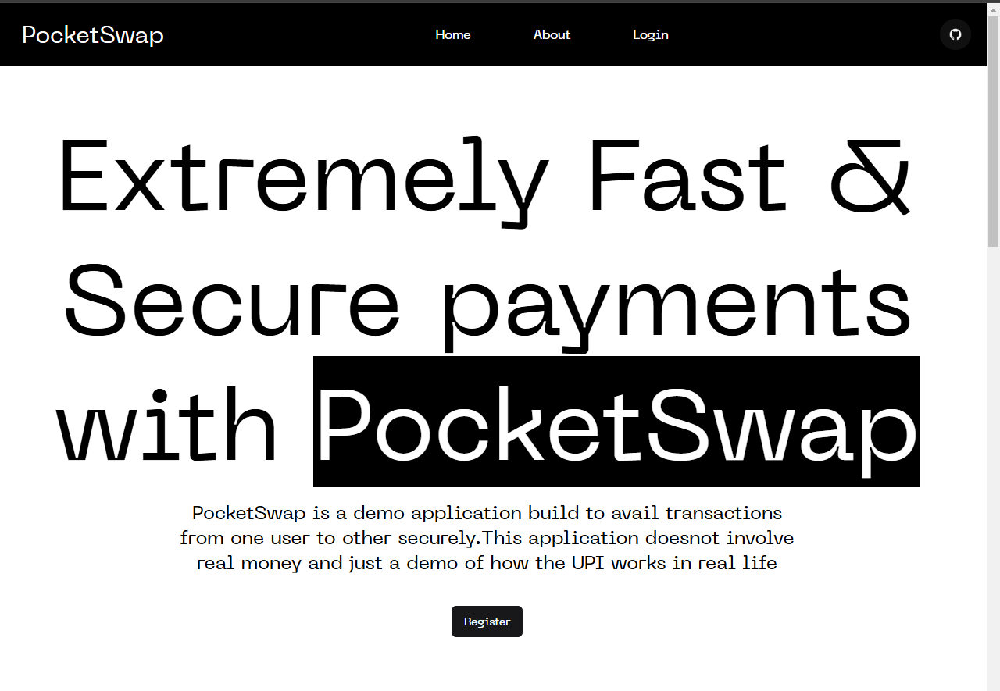
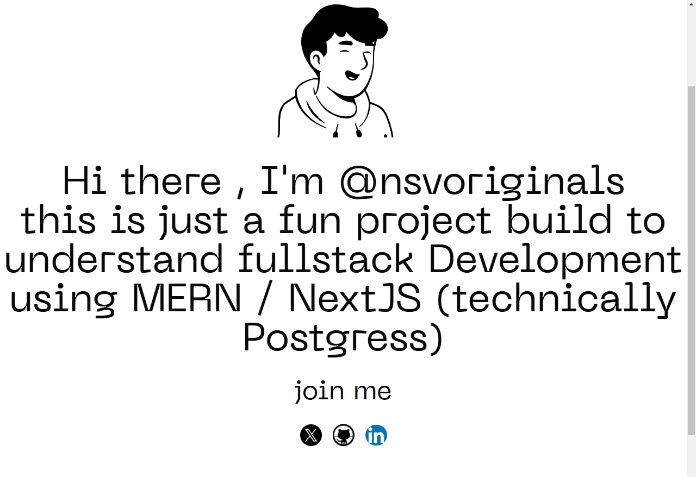
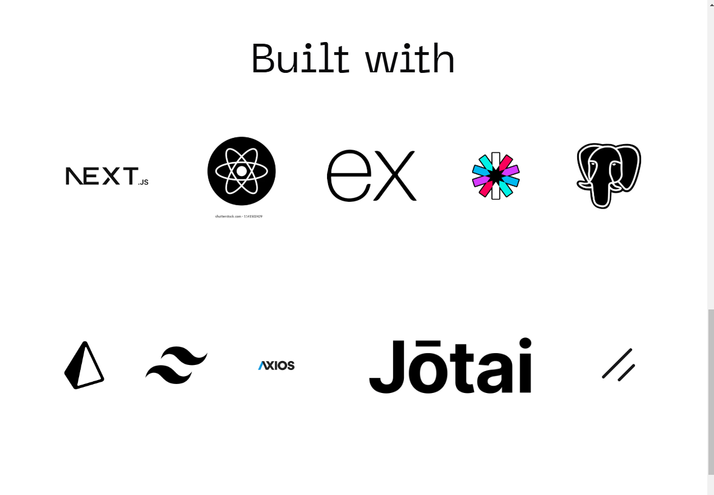

#  Pocketswap

Pocketswap is a UPI (Unified Payments Interface) simulation that demonstrates how real-life touchless payments work. It provides an intuitive experience for users to simulate transactions, manage accounts, and understand UPI-style payment systems.

## Technologies Used

- 
- 
- 
- 
- 
- 
- 
- 
- 
- 
- 

## Project Description

Pocketswap is a UPI simulation app that replicates touchless payment processes, such as those seen in real-world UPI apps like Paytm. The project allows users to simulate transactions, manage their accounts, and interact with a payment system in an intuitive and user-friendly interface.

  
*Home Page*

  
*About Page*

  
*Technology Stack*

## Features

- **User Authentication**: Secure sign-up and login using JWT authentication.
- **Payment Simulation**: Simulate UPI-style touchless payments between users.
- **Real-time Balance Updates**: Instant balance updates for users.
- **Account Management**: Manage user profiles and view payment history.
- **Responsive Design**: Built with Tailwind CSS for a modern, responsive UI.
- **State Management**: Utilizes Jotai for state management across components.

## Installation

To get started with the project, follow these steps:

1. Clone the repository:

   ```bash
   git clone https://github.com/nsvoriginals/pocketswap.git
   cd pocketswap

2.Install packages :
     
     
     npm install


3.Run the application 
     
    
     npm run dev


## Next Steps

Once you have successfully installed and run the project, here are a few suggestions for next steps to further improve or contribute to the project:

### 1. **Explore the Code**
   - Dive into the backend and frontend code to understand how the different parts of the application communicate with each other.
   - Review how JWT authentication is handled in the backend to secure user data.
   - Investigate how state management is done using **Jotai** in the frontend.

### 2. **Enhance User Interface**
   - Customize the **Tailwind CSS** styles or integrate other UI frameworks to improve the design or create a new theme for the application.
   - Add features like payment history, detailed account views, or even dark mode.

### 3. **Implement New Features**
   - **Multiple Users Support**: Add the functionality to simulate payments between multiple users.
   - **Transaction History**: Build a page that shows transaction history with details about each transaction.
   - **Security Improvements**: Explore adding features like two-factor authentication (2FA) for added security.

### 4. **Add Unit and Integration Tests**
   - Consider writing tests for both the frontend and backend using tools like **Jest** or **Cypress** to ensure your application remains robust and bug-free as you make changes.

### 5. **Deploy the Application**
   - Deploy the application to a platform like **Vercel** for the frontend and **Heroku** or **Render** for the backend.
   - Set up continuous deployment (CD) so that every change you push to the repository is automatically deployed to production.

### 6. **Documentation**
   - Consider expanding the documentation to include setup instructions for deploying the app, API documentation, or user guides to enhance usability.

### 7. **Contribute**
   - If you're interested in helping improve **Pocketswap**, contribute by opening issues or submitting pull requests with enhancements, bug fixes, or features.
   - Ensure that your contributions follow the coding standards and that the code is well-tested and documented.

---

## Contact

For any questions, suggestions, or issues, please feel free to open an issue or reach out to me directly.

You can reach me at:
- **Email**: [shashivardhan34@gmail.com](mailto:shashivardhan34@gmail.com)
- **GitHub**: [github.com/nsvoriginals](https://github.com/nsvoriginals)

---

## Acknowledgments

- Special thanks to all contributors to the project.
- Thanks to the open-source community and resources like [Tailwind CSS](https://tailwindcss.com/), [Prisma](https://www.prisma.io/), and [PostgreSQL](https://www.postgresql.org/).
- Inspiration from the real-world UPI systems, especially apps like Paytm, for their seamless user experience.

---

## License

This project is licensed under the MIT License - see the [LICENSE](LICENSE) file for details.